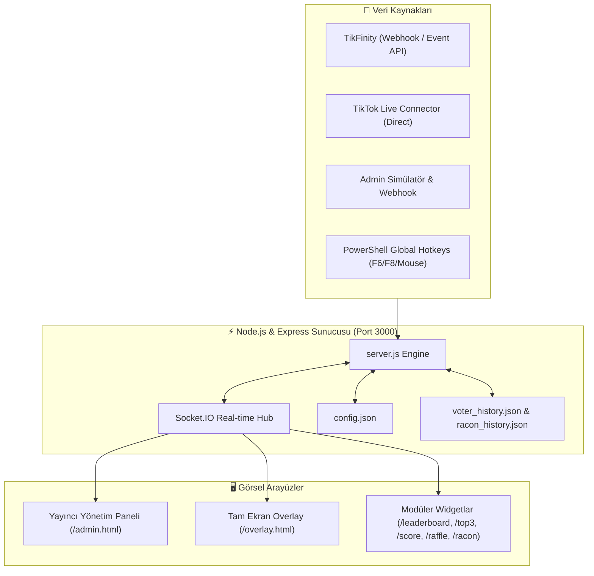

# ⚡ TikTok Live Rating & Leaderboard Overlay (V6)

[](https://nodejs.org/)
[](https://socket.io/)
[](https://expressjs.com/)
[](https://obsproject.com/)
[](https://www.tiktok.com/studio/download)
[](LICENSE)

**TikTok Live Studio & OBS Studio** için geliştirilmiş, izleyicilerin canlı yayında chate yazdığı **1-10 arası puanları** anlık olarak toplayan, canlı leaderboard, geri sayım sayacı, ortalama puan hesaplama, dinamik Tier/Rating sonuç kartları, CS-tarzı yatay rulet çekiliş sistemi ve "Racon Kralı" sıralamasını sunan **yeni nesil, modüler yayıncı overlay sistemi**.

---

## 📑 İçindekiler

- [Öne Çıkan Özellikler](#-öne-çıkan-özellikler)
- [Mimari & Modüler Yapı](#-mimari--modüler-yapı)
- [Sistem Gereksinimleri](#-sistem-gereksinimleri)
- [Hızlı Kurulum](#-hızlı-kurulum)
- [TikTok Live Studio & OBS Kurulumu](#-tiktok-live-studio--obs-kurulumu)
- [Modüler Widget URL Listesi](#-modüler-widget-url-listesi)
- [Canlı Sohbet Bağlantı Seçenekleri](#-canlı-sohbet-bağlantı-seçenekleri)
  - [1. TikFinity Entegrasyonu (Önerilen)](#1-tikfinity-entegrasyonu-önerilen)
  - [2. Doğrudan TikTok Bağlantısı](#2-doğrudan-tiktok-bağlantısı)
- [Global Klavye & Fare Kısayolları (Hotkeys)](#-global-klavye--fare-kısayolları-hotkeys)
- [Yayıncı Kontrol Paneli & Offline Simülatör](#-yayıncı-kontrol-paneli--offline-simülatör)
- [REST API & Webhook Dokümantasyonu](#-rest-api--webhook-dokümantasyonu)
- [Yapılandırma Dosyası (config.json)](#-yapılandırma-dosyası-configjson)
- [Sorun Giderme (FAQ)](#-sorun-giderme-faq)
- [Lisans](#-lisans)

---

## ✨ Öne Çıkan Özellikler

- 💬 **Anlık Chat Puanlama (1-10):** Chat akışındaki tüm oyları gerçek zamanlı yakalar, filtreler ve ortalamaya dahil eder.
- ⏱️ **Canlı Sayaç & Aciliyet Uyarısı:** Dinamik geri sayım çubuğu ve son saniyelerde ekrana çıkan dikkat çekici aciliyet uyarısı (*"SON 10 SANİYE, ACELE!"*).
- 🏆 **Top 3 Podyum & Oy Listesi:** Tur boyunca en çok puan veren veya en son oy kullanan izleyicilerin avatar ve kullanıcı adlarıyla canlı podyum görünümü.
- 🎭 **Dinamik Rating / Tier Kartları:** Tur bittiğinde ortalama puana göre otomatik derecelendirme (F-Tier'dan S-Tier / Efsane'ye kadar animasyonlu sonuç kartı ve ses efektleri).
- 🎰 **CS Kasa Açma Tarzı Çekiliş Ruleti:** Tura katılan izleyiciler arasından canlı yayında çark döndürerek şanslı izleyici veya aday seçimi.
- 👑 **Racon Kralı Sıralaması (Top 5 Leaderboard):** Yayın boyunca en çok katkı sağlayan ve puan toplayan sadık izleyicilerin kümülatif sıralaması ve özel rütbe rozetleri (*Sağ Kol, Racon Kesen* vb.).
- 🧩 **100% Modüler Widget Mimarisi:** İster tüm ekranı tek linkte kullanın, ister OBS sahnenizde her bir bileşeni (sayaç, podyum, çekiliş, liste) ayrı ayrı konumlandırın.
- ⌨️ **Global Klavye ve Mouse Hotkey:** Oyun veya tam ekran yayındayken klavye (`F6`, `F7`, `F8`) veya fare yan tuşları (`Mouse4`, `Mouse5`) ile tur başlatıp çekiliş tetikleme.
- 🛡️ **Anti-Troll & Çift Oy Koruması:** Spam oyları engelleme veya kullanıcının oyunu sonradan güncellemesine izin verme/vermeme seçenekleri.
- 🧪 **Gelişmiş Offline Simülatör:** Yayında değilken bile yüksek puan, düşük puan, nötr veya rastgele bot akışı ile overlay'i test etme olanağı.
- 🔊 **Web Audio API Ses Motoru:** Sayaç tik sesleri, aciliyet alarmları, sonuç patlamaları ve rulet dönüş efektleri.

---

## 🏛️ Mimari & Modüler Yapı

Sistem **Node.js, Express, Socket.IO ve Vanilla JS/CSS** kullanılarak sıfır harici frontend bağımlılığıyla ultra hafif ve yüksek performanslı olarak tasarlanmıştır.



---

## 📋 Sistem Gereksinimleri

- **İşletim Sistemi:** Windows 10 / 11, macOS veya Linux
- **Node.js:** v16.0.0 veya üzeri ([Node.js İndir](https://nodejs.org/))
- **Yayın Yazılımı:** [TikTok Live Studio](https://www.tiktok.com/studio/download) veya [OBS Studio](https://obsproject.com/)

---

## 🚀 Hızlı Kurulum

### 1. Depoyu İndirin / Klonlayın
```bash
git clone https://github.com/omerfys/tiktok-live-rating-overlay.git
cd tiktok-live-rating-overlay
```

### 2. Bağımlılıkları Yükleyin
```bash
npm install
```

### 3. Sunucuyu Başlatın
- **Windows için:** Klasör içindeki `start.bat` dosyasına çift tıklayın.
- **Alternatif (Terminal üzerinden):**
```bash
npm start
```

### 4. Panellere Erişin
Sunucu başladığında tarayıcınızda otomatik açılacaktır:
- 🎛️ **Yönetici Kontrol Paneli:** [http://localhost:3000/admin.html](http://localhost:3000/admin.html)
- 📺 **Tam Ekran Overlay:** [http://localhost:3000/overlay.html](http://localhost:3000/overlay.html)

---

## 📺 TikTok Live Studio & OBS Kurulumu

Overlay'i yayın ekranınıza saydam bir katman olarak eklemek için:

1. **TikTok Live Studio** veya **OBS Studio**'yu açın.
2. Sahnenizde **+ Kaynak Ekle** butonuna tıklayın ve **Tarayıcı (Browser Source)** seçeneğini belirleyin.
3. Kaynak özelliklerini şu şekilde ayarlayın:
   - **URL:** `http://localhost:3000/overlay.html`
   - **Genişlik (Width):** `1080` (Dikey yayınlar için) veya `1920` (Yatay yayınlar için)
   - **Yükseklik (Height):** `1920` (Dikey yayınlar için) veya `1080` (Yatay yayınlar için)
   - **Özel CSS / Arka Plan:** Otomatik olarak şeffaftır (transparent).
   - **Sayfa görünür değilken kapat:** *İşareti kaldırın (isteğe bağlı).*
4. Kaynağı sahnenizde istediğiniz katmana yerleştirin ve kilitleyin.

---

## 🧩 Modüler Widget URL Listesi

Tüm ekranı tek bir overlay olarak kullanmak yerine OBS sahnenizde bileşenleri parça parça eklemek isterseniz aşağıdaki URL'leri ayrı Tarayıcı Kaynakları (Browser Source) olarak ekleyebilirsiniz:

| Widget Adı | URL Endpoint | Açıklama |
| :--- | :--- | :--- |
| **Tam Ekran (Tümü)** | `http://localhost:3000/overlay.html` | Tüm bileşenleri içeren 1080x1920 tam katman |
| **Sol Leaderboard** | `http://localhost:3000/leaderboard.html` | Son oy kullanan izleyicilerin dikey kart listesi |
| **Top 3 Podyum** | `http://localhost:3000/top3.html` | En çok oy kullanan ilk 3 izleyicinin podyumu |
| **Puan & Sayaç** | `http://localhost:3000/score.html` | Üst ortalama puan, kalan süre ve toplam oy kutusu |
| **Acil Text Kutusu** | `http://localhost:3000/urgency.html` | Son 10 saniye uyarı banner'ı |
| **Sonuç & Rating** | `http://localhost:3000/result.html` | Tur bitişi Tier sonuç kartı (Efsane/Berbat vb.) |
| **Çekiliş Ruleti** | `http://localhost:3000/raffle.html` | Yatay kayan CS-tarzı çekiliş ruleti ve aday profili |
| **Racon Kralı (Top 5)** | `http://localhost:3000/racon.html` | Yayın boyunca kümülatif puan şampiyonları listesi |

> 💡 **Önizleme İpucu:** Herhangi bir widget URL'sinin sonuna `?preview=1` eklerseniz (Örn: `http://localhost:3000/leaderboard.html?preview=1`), tur başlatmadan widget'ın tasarımını ekranda görebilir ve OBS'te boyutunu kolayca ayarlayabilirsiniz.

---

## 🔗 Canlı Sohbet Bağlantı Seçenekleri

### 1. TikFinity Entegrasyonu (Önerilen)
TikFinity, TikTok canlı yayınlarında chat ve hediye verilerini çekmenin en stabil ve güvenli yoludur.

- **Otomatik Event API:**
  1. TikFinity uygulamasını açın ve **TikTok LIVE'a bağlanın**.
  2. TikFinity'de **Event API** özelliğini aktif hale getirin.
  3. Overlay sunucusu port 3000 üzerinden chat mesajlarını otomatik dinleyecektir.
- **Manuel Webhook ile Gönderim:**
  1. TikFinity sol menüsünden **Actions & Events** (Eylemler) sekmesine gidin.
  2. **Yeni Eylem** ➔ **Webhook Gönder (HTTP Request)** seçin.
  3. **URL:** `http://localhost:3000/api/webhook`
  4. **Tetikleyici (Trigger):** `Chat Message` seçip kaydedin.

### 2. Doğrudan TikTok Bağlantısı
TikFinity kullanmak istemiyorsanız:
1. TikTok'ta canlı yayına geçin.
2. Yönetici Paneli'nde ([http://localhost:3000/admin.html](http://localhost:3000/admin.html)) **TikTok Kullanıcı Adınız** kutusuna profil adınızı yazın.
3. **"Bağlan"** butonuna basın. Durum yeşile dönecektir.

---

## ⌨️ Global Klavye & Fare Kısayolları (Hotkeys)

Windows üzerinde çalışırken oyun veya yayın penceresine odaklanmış olsanız dahi arka plandaki PowerShell servisi sayesinde tek tuşla işlem yapabilirsiniz:

- **Varsayılan Tuşlar:**
  - `F6` : Puanlama Turunu Başlat / Durdur (Toggle)
  - `F7` : Turu Erken Bitir (Stop)
  - `F8` : Çekiliş Ruletini Başlat / Kapat (Toggle Raffle)
- **Fare Tuşu Desteği:**
  - Fare yan tuşları (`MOUSE4`, `MOUSE5`), orta tuş (`MOUSEMIDDLE`) veya dilediğiniz özel tuş kombinasyonlarını Yönetici Paneli Ayarlarından kolayca tanımlayabilirsiniz.

---

## 🎛️ Yayıncı Kontrol Paneli & Offline Simülatör

Yönetici Paneli üzerinden:
- **Puanlama Turu Başlatma:** Başlık, kategori, tur süresi (varsayılan 20 sn) ve sonuç gösterme süresini belirleyin.
- **Canlı Önizleme:** Ekranda kaç oy toplandığı, anlık ortalama ve chatten gelen oyları panelden izleyin.
- **Çekiliş Havuzu:** Önceki turlarda oy kullanan izleyicilerin listesini görün ve dilediğiniz an tek tıkla canlı çekiliş başlatın.
- **Racon Kralı Sıralaması:** İzleyicilerin puanlarını düzenleyin, sıfırlayın veya manuel puan ekleyin.
- **Simülatör:** Canlı yayın olmadan overlay'i denemek için tek tıkla:
  - 🎲 *Rastgele Simülasyon* (1-10 karışık)
  - 🔥 *Yüksek Puan Simülasyonu* (9-10 oyları - Efsane Tier)
  - 😐 *Nötr Simülasyon* (5-6 oyları - Ortalama Tier)
  - 💀 *Düşük Puan Simülasyonu* (1-3 oyları - Berbat Tier)

---

## 📡 REST API & Webhook Dokümantasyonu

Harici Stream Deck, bot veya otomasyon araçları ile sistemi kontrol etmek için kullanabileceğiniz API uç noktaları:

### 1. Yeni Tur Başlatma / Durdurma
```http
POST /api/round/toggle
Content-Type: application/json

{}
```

### 2. Özel Parametrelerle Tur Başlatma
```http
POST /api/webhook
Content-Type: application/json

{
  "action": "start",
  "title": "Beni 1-10 Puanlayın!",
  "category": "Kıyafet",
  "duration": 15
}
```

### 3. Harici Oy Gönderme (Bot / Simülasyon)
```http
POST /api/webhook
Content-Type: application/json

{
  "username": "Kullanici_Adi",
  "nickname": "Görünen Ad",
  "score": 9,
  "avatar": "https://p16-sign-va.tiktokcdn.com/..."
}
```

### 4. Çekilişi Tetikleme
```http
POST /api/webhook/raffle/toggle
Content-Type: application/json

{}
```

---

## ⚙️ Yapılandırma Dosyası (config.json)

Tüm varsayılan ayarlar `config.json` dosyasında saklanır ve yönetici panelinden yapılan değişikliklerle otomatik güncellenir:

```json
{
  "port": 3000,
  "tiktokUsername": "",
  "tiktokSessionId": "",
  "roundDuration": 20,
  "resultDisplayDuration": 2.5,
  "defaultTitle": "Chate 1-10 yazın, acımayın!",
  "defaultCategory": "Chat konuşuyor",
  "allowVoteUpdate": false,
  "antiTrollProtection": false,
  "autoRaffleOnRoundEnd": false,
  "soundEnabled": true,
  "hotkey": "F6",
  "stopHotkey": "F7",
  "raffleHotkey": "F8",
  "ratingTiers": [
    { "min": 1.0, "max": 2.9, "title": "BERBAT BU", "subtitle": "chat hiç acımadı!", "color": "#ef4444", "badge": "F-TIER" },
    { "min": 3.0, "max": 4.9, "title": "KÖTÜ BU", "subtitle": "chat pek beğenmedi...", "color": "#f97316", "badge": "D-TIER" },
    { "min": 5.0, "max": 6.9, "title": "ORTALAMA BU", "subtitle": "fena değil, idare eder.", "color": "#eab308", "badge": "C-TIER" },
    { "min": 7.0, "max": 8.4, "title": "İYİ BU", "subtitle": "chatın beğenisini kazandın!", "color": "#38bdf8", "badge": "B-TIER" },
    { "min": 8.5, "max": 9.4, "title": "HARİKA BU", "subtitle": "chat bayağı yükseldi!", "color": "#4ade80", "badge": "A-TIER" },
    { "min": 9.5, "max": 10.0, "title": "EFSANE BU", "subtitle": "rekor kırıldı galiba!", "color": "#fbbf24", "badge": "S-TIER / REKOR" }
  ]
}
```

---

## ❓ Sorun Giderme (FAQ)

### S: TikTok Live Studio'da overlay görünmüyor veya arka plan siyah kalıyor?
> **C:** Tarayıcı kaynağı (Browser Source) ayarlarında URL'nin `http://localhost:3000/overlay.html` olduğundan ve sunucunun çalıştığından emin olun. Genişliği `1080`, Yüksekliği `1920` olarak ayarlayın.

### S: Chatten gelen oylar ekrana yansımıyor?
> **C:** En stabil yöntem TikFinity kullanmaktır. TikFinity'de Event API'yi açın veya Eylemler kısmından `http://localhost:3000/api/webhook` adresine sohbet webhook'u ekleyin. Doğrudan TikTok kullanıcı adı ile bağlanıyorsanız, yayının açık ve herkese açık olduğundan emin olun.

### S: Kısayol tuşları (Hotkeys) basınca tepki vermiyor?
> **C:** PowerShell arka plan dinleyicisinin çalıştığından emin olun. `server.js` başlatıldığında otomatik olarak `hotkey_listener.ps1` dosyasını çalıştırır. Windows kısıtlamaları varsa PowerShell'i yönetici olarak açıp `Set-ExecutionPolicy RemoteSigned` komutunu çalıştırabilirsiniz.

---

## 📜 Lisans

Bu proje **MIT Lisansı** altında lisanslanmıştır. Detaylar için [LICENSE](LICENSE) dosyasına göz atabilirsiniz.

---

<div align="center">
  <sub>Geliştirici: <b>omerfy</b> • TikTok Canlı Yayın Topluluğu İçin Sevgiyle Geliştirildi ❤️</sub>
</div>
